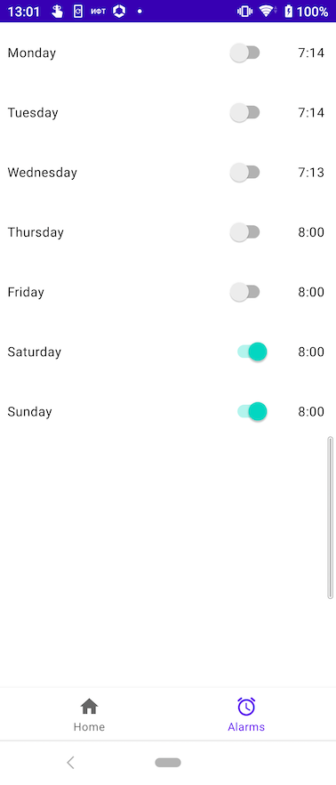

# MagicLamp: Controlling app for [GyverLamp](https://alexgyver.ru/gyverlamp/)
GyverLamp is electronic device based on LED matrix, contains lots of different light effects

### Device principles
Matrix connected to NodeMCU module for Wi-Fi interaction with outer clients, and have sensor button on board
for manual user controlling

### Application overview
Now application has two main feature screens

#### Main screen
In the top of the screen there is connection status (if successful - current lamp IP address) and power button.
Main screen allows setting main effect's parameters - brightness, speed and scale, also it has list of available 
effects that we can refresh by swipe down.

#### Alarms screen
This feature allows user to set "dawn" alarm when lamp will gradually increase self brightness in particular time.
API of lamp isn't really handy and we can set only one alarm per day. In feature releases I plan to workaround this
constraint by client code.

#### Architecture
MVVM + Coroutines + UDP socket + Clean
Now it's contains only one monolithic module, but in the future I'll divide it in feature modules
